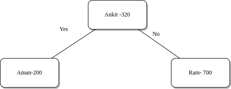
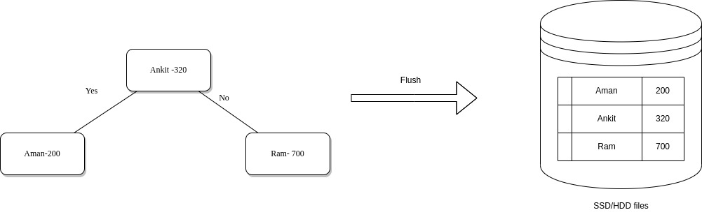
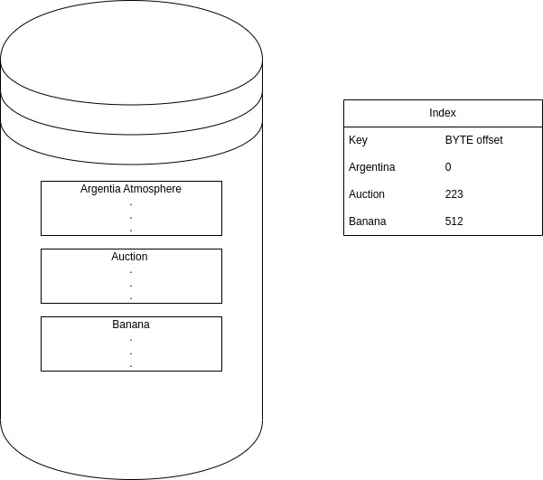
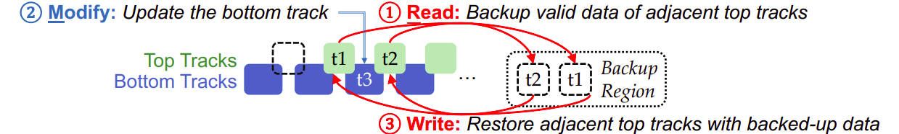

## Log structured merge tree
lsm tree is a popular data structure for higher write throughput. It is used by big companies like Google, Bigtable, Facebook, RockDB, etc. 
lsm tree will solve the problem of keys as well as the range queries are really good with this data structure. The essence of lsm trees is based on the fact that the keys are always stored in sorted manner. So we are incurring some cost to maintain this sortedness of the table or the storage engine. 
You can break down an LSM tree into 3 parts
* memtable
* Index
* SStables (also knwon as Sorted String table)

the memtable and Index are inside the Memory while the SStable persists on disk.

For every write which comes our way we are going to insert this into a in memory read block tree which is basically giving us the sortedness. It will be sorted on the keys. 
This table represents the write operations that this database needs to handle.

|Name   |Index|
|-------|-----|
| Aman  | 200 |
| Ram   | 700 |
| Ankit | 320 |
| Aman  | 220 |
| Rohan | 133 |
| Sumit | 222 | 

The value of this table is then pushed to an self balancing avl tree so the height of the tree will always be log(n).  
This is nothing but the mem table portion we are talking about.

Once the tree crosses a certain size it will persist that or lfush this to hard disk (this is a bit costly operation.)
Since now we have a binary tree we can iterate it in ascending order and store this key value paris in ascending order. This is what the soreted string pair is all about.

In actuality the size of the tree will be large say in Megabytes. In a really huge sstable the key will be sorted due to BST tree. Now we will divide this segment or file into serveral blocks each block say of size 10Kb. Now we are certain an index will be in memory. Now we will only keep the top fo each block in memorysparx index. 

By this we have cut down on the limitation that if the number of trees are really huge and not fitting in ram you could not have used. But now since we are not maintaing every key in ram this limitation can go away. But if the key does not exist it will waste a lot of time. This can be optimizted using bloom filters. Bloom filters can tell if the key is not present and can tell if it may be present in O(1) time complexity. Another prolbem which can occur in LSM-tree is write may be lost. Say for 1000 entries we are doing in memory write. So if there is a power cut there is a dataloss issue. We can resolve this by using append only log for In-memory trees by which recovery is now possible.

## KVIMR: Key-Value Store Aware Data Management Middleware for Interlaced Magnetic Recording Based Hard Disk Drive 

### Interlaced Magnetic Recording
The traditional harddisk utilizes only the top part of the disk to read and write. But to provide more storage in the same space Interlaced magnetic recording is Introduced in which it utilizes the bottom part of the disk as well to read and write. The problem with this approach is that after wrtining at the bottom of the disk there is a possibility that the data which was at the top of the disk may be lost. So Read-Modify-Write (RMW) is introduced to rewrite top tracks (if needed) when updating a bottom track: 

