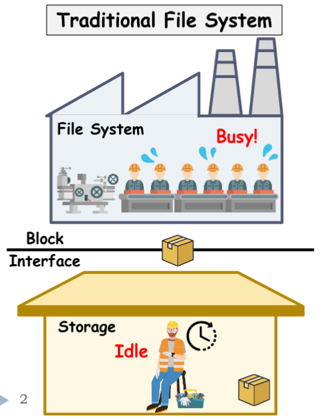
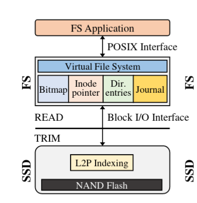
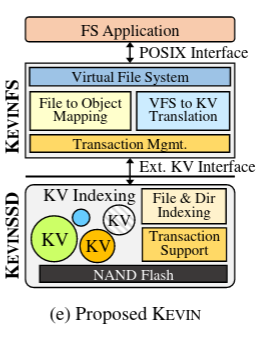
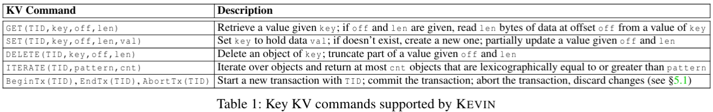
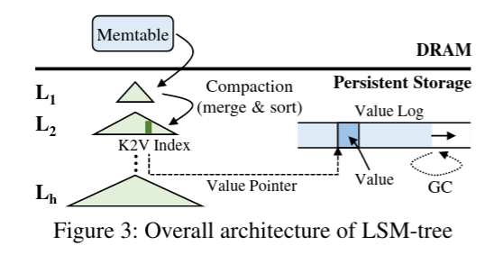
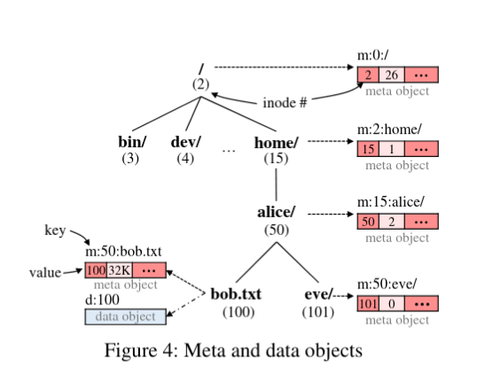

Primer:

What's a Block Storage:
A Storage Device's Data Space is broken up into fixed sized chunks or blocks. Blocks are addressed by a unique logical block address and themselves are raw data which carry no additional information, hence they need some additional metadata to index and to add additional functionalities in the storage device. 

Filesystem:
A Data structure that's used to store and retrieve data from the underlying storage device. A file-system depending on the implementation undertakes multiple responsibilities, provides directory hierarchy, metadata about files and directories such as timestamps for creation and modification, permissions and ownership, symlinks and hardlinks, journaling for integrity and much more. A filesystem at it's core must be able to support file operations efficiently as possible.

Limitation of Current Filesystem:

![[Pastedimage20221108182549.png]]

![[Pastedimage20221107184218.png]]
Meta Data Required:
- Bitmap: Free Space Management
- Inode Pointer: Indexing Files and Directories Uniquely
- Directory Entries
- Journaling: Logs Transactions, Helps in Restoring Filesystem Integrity in the event of a unexpected system crash/failure.

Writes, and Updates results metadata in-addition to data to be written back to the device this results in reduced CPU and I/O throughput. For an Write Intensive application this is more pronounced and delete cause fragmentation which leads to inefficient information retrieval and is detrimental to graceful filesystem aging

Solution: Reduce Metadata traffic by handling parts of it in the underlying storage. But to what  degree?

Review of Literature:
- Extended Block I/O Interface: Move Journaling to Filesystem, and a have a journal management engine at the kernel. It's partiucularly useful if data is a part that's being journaled. But can we do more? What about the Fragmentation part?
- File Indexing Interface(DevFS): Push all the filesystem to the underlying storage device. No metadata is transported, only trivial system calls are implement at the kernel level that takes care of all the filesystem operations. Sounds good but filesystem operations are complex, needs complex and dedicated hardware with good CPU and RAM, this also makes it inflexible and needs to support firmware updates for bugs. Maybe there's a middle ground?

Proposed Architecture:

 
![[Pastedimage20221107191119.png]]
![[Pastedimage20221107192850.png]]
![[Pastedimage20221107192346.png]]

Key Value Storage:
Key value storage exposes variable sized objects unlike block storage devices. But unlike block storage, data once created can't be modified thus leads poor append and update performance. This also impacts SSDs due to wearing thus limiting the write cycles. Nonetheless, to a certain degree is of key interest as is mimic programming languages key value stores and real world databases.
Things to Know Beforehand:

LSM and B^\epsilon write optmized
Written to storage's DRAM's L_1 memtable and is full flushed out to persistent storage, when full, each level is compacted and merged with the next higher level.
- We manage keys in LSM Tree and Values are written a value log separately for reducing compaction costs.
- Each Level contains a Key to Value Index(K2V), this decreases LSM Tree's size and increases performance
- A Bloom Filter is used in each level to efficiently test for membership of an object.

Architecture
KV Interaface:
KEVIN SSD:

Data Storage and Indexing
3 Type of KV objects superblock, meta and data objects

![[Pastedimage20221108193252.png]]

An Object key is prefixed by `m:` for meta data and `d:` for data object, the inode number of the parent directory followed by another colon, then a file/directory name.  Root Directory's parent inode value is 0 and it's inode value is 2.

- A Regular File contains a pair of meta data object containing inode key and size and data object containing data.  For smaller files under 4KB it packs meta data and item together. To Improve Append and Update performance, the data object and be split into chunks represent parts of the file, kevin offers single level of indirection.
- Directory has only meta data containing total number of subdirectories and files. 
- Directories support iterate, and both files and directories could be modified by get and set.

For Indexing we use LSM trees, we maintain a tiny in-memory table in storage's RAM that contains and start and end key and a pointer to the location in the flash page. All keys are sorted in their level for faster retrieval. The Values are stored separately which greatly reduces its size, and the K2V index stores a key and value pointer.

Inode Based indexing allows faster file operations and removes complex tree operations.

For Iteration needs directories inode and count, files and subdirectoires are stored in sorted order under the same level. Unlike like Block File system which indexes using complex B-Trees, we use LSM trees with bloom filters that effectively reduces expected memory access to one.

Performance Improvements
- Separate Keys and Values.
- Compress K2V indices, sub-object have recurring pattern.
- Caching in-storage
- for write heavy workloads
- DRAM 10GB file requires 45MB KV pairs with compression 10.8MB.

Operations:
- Write: Uses `SET` and `DELETE`, `unlink` uses two `DELETES` to remove meta data andd data object, leaves a tombstone of 4B later for removal during compaction, unlike EXT4 which requires modification to inode bitmaps, directory entires and update tree structure. `SET` first creates a buffer in memtable and appends to flash later. 
- Read:  Uses `GET` and `ITERATE`, given a full pathname, it traverses directories from the root to subsequent directories leading up to the file /directory for which KEVIN has to read the entire LSM tree several times, thanks to bloom filters tree search requires less than two reads. EXT4 requires loading of several on-disk data structures such as inode table, extent tree and indexes pointers into the memory, KEVIN avoids that using in-storage indexing. KEVIN lookup at LSM tree to locate data. File in EXT4 are referenced under a tree which adds I/O costs which doesn't include the cost of search for the directory under a the BTREE itself. KEVIN has one layer of indirection providing good performance. 
